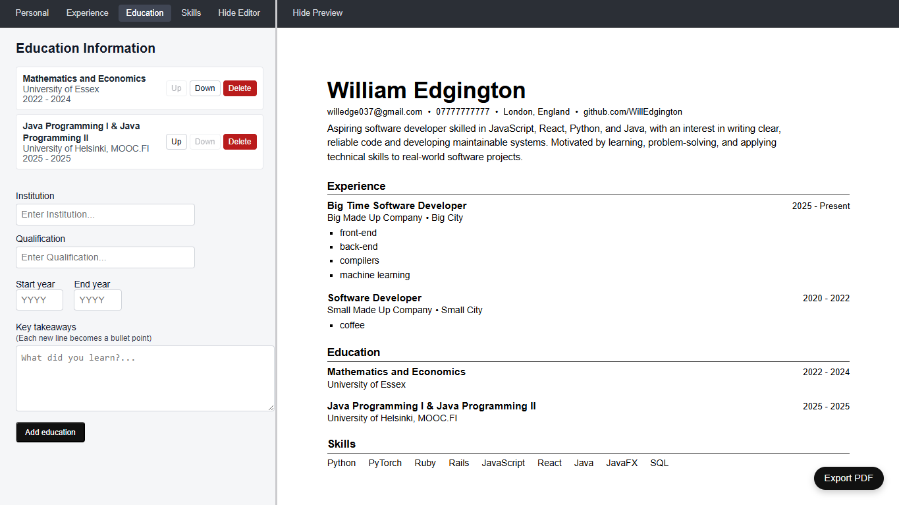
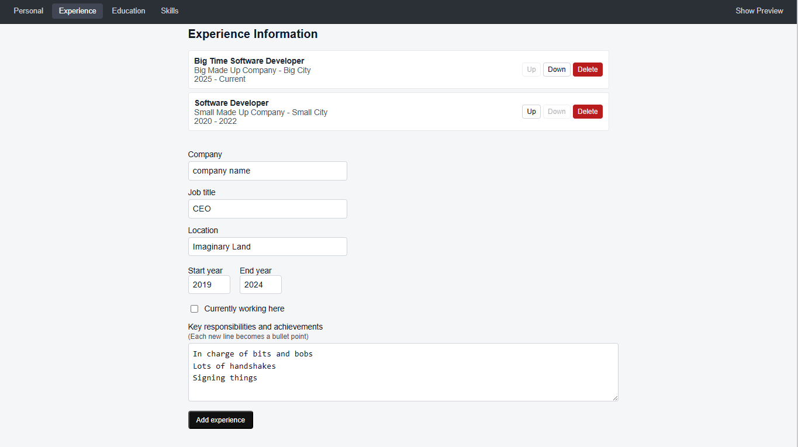
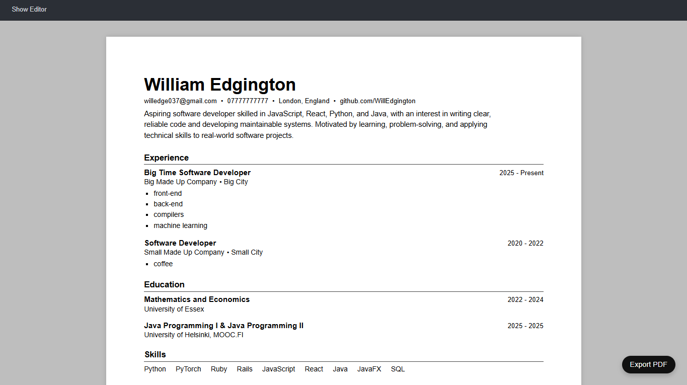

# React CV Builder

This is a clean, professional CV builder application built with React that allows users to create, preview, and export a one-page CV as a PDF.

## Features

- Live CV preview with print-ready layout
- Section-based editor (Personal, Experience, Education, Skills)
- Reorderable items (move up/down)
- Inline form validation
- Bullet-point descriptions via newline input
- Local storage persistence
- One-click PDF export
- Printer-friendly styling

## Tech Stack

- React
- CSS (modularised by feature)
- Vite

## Design Decisions

- **Print-first layout**: CV preview matches exported PDF exactly (once margin disabled)
- **Minimalist editor UI**: focus on clarity and usability
- **No external UI libraries**: all styling done with custom CSS
- **Explicit state management**: predictable updates via reducer

## Future Improvements
- Keyboard accessibility
- Responsive layout for mobile
- Drag-and-drop reordering
- Inline editing of existing entries

## Contact
Created by [**WillEdgington**](https://github.com/WillEdgington) for a project in the React module of the [**Odin Project**](https://www.theodinproject.com/lessons/react-new-cv-application) course.

📧 **willedge037@gmail.com**

🔗 [**LinkedIn**](https://www.linkedin.com/in/williamedgington/)

## Screenshots

